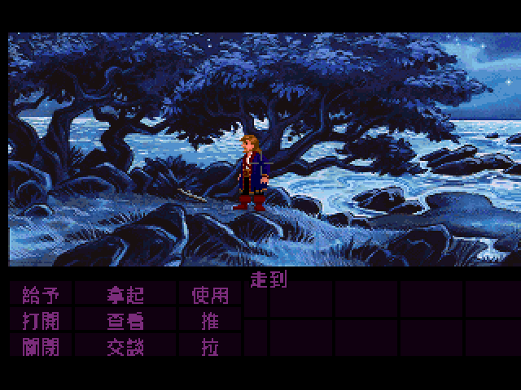
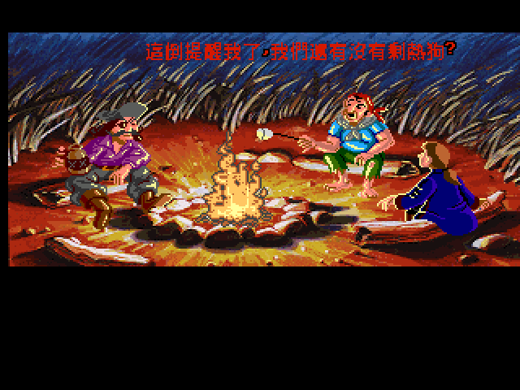
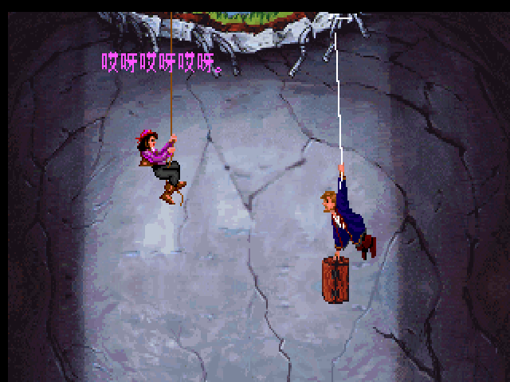

# 猴島小英雄 II：里察克的復仇 — 繁體中文化

> Monkey Island 2: LeChuck's Revenge（1991，LucasArts）繁體中文化專案
> 引擎：LucasArts SCUMM v5（ScummVM `monkey2`）。社群非官方作品，與 LucasArts / Disney 無關聯。

> 🎡 **線上試玩密碼盤**：不用裝遊戲，直接在瀏覽器轉那張當年的巫毒轉盤 →
> **<https://wicanr2.github.io/monkey_island2_cht/mixnmojo/>**
> （用實體轉盤原圖做的，密碼直接從上盤透明視窗透出來，跟你手上那張紙盤一模一樣。）

**目錄**：[寫在前面](#寫在前面) · [蓋布拉許回來了](#故事鉤子) · [軟體世界與那把鑰匙圈萬用刀](#軟體世界) · [人物・地名譯名對照](#譯名對照) · [巫毒配方轉盤](#防拷轉盤) · [這次中文化做了什麼](#中文化做了什麼) · [技術深潛](#技術深潛)（[一鍵重建](#一鍵重建) · [目錄結構](#目錄結構) · [版權](#版權)）· [怎麼玩](#怎麼玩) · [致謝](#致謝)

<a name="寫在前面"></a>
## 寫在前面

還記得那個晚上嗎——你把磁片一片一片塞進 5.25 吋磁碟機，螢幕上跳出兩個轉個不停的怪東西，逼你拿出包裝盒裡那張紙做的雙層轉盤，對齊圖案、抄下兩組數字。抄錯了，猴子在畫面上笑你「過不了關而鬱卒嗎？」。抄對了，才總算看到蓋布拉許・特普伍德被吊在懸崖上，狼狽地跟舊情人講一個他自己都編不圓的故事。

那年這款遊戲由軟體世界代理，包裝上印著「冒險珍藏版 156」，定價 NT$460，隨盒附一把印著「猴島英雄」字樣的鑰匙圈萬用刀。沒有攻略網站、沒有 wiki，只有那本 32 頁的操作手冊，和玩家自己想破頭的耐心。

這個 repo 做的事很單純：把這台三十多年前的加勒比海鬧劇，重新翻成繁體中文，讓它能在原版 ScummVM 上直接跑。沒有改任何引擎原始碼，沒有重製美術，只是把 7499 行對白重新說一次——用你聽得懂的話。

下面這份文件分三段讀：想直接動手玩，跳到[怎麼玩](#怎麼玩)；想重溫劇情和當年台灣代理的故事，接著往下讀；想知道技術上到底怎麼做到零引擎修改的，直接跳[技術深潛](#技術深潛)。

---

<a name="故事鉤子"></a>
## 蓋布拉許回來了

上一次，笨拙的自封海盜蓋布拉許・特普伍德打敗了鬼船長里察克，抱得美人歸——威木鎮女市長艾蓐妮・瑪蕾。照理故事該在這裡結束。

但沒有。多年後，蓋布拉許當年的英勇事蹟早被以訛傳訛講到面目全非，沒人再信他真打敗過一個鬼船長；更糟的是，坊間開始傳里察克其實沒死透。蓋布拉許閒得發慌，也想給自己找點新鮮的吹噓題材，於是重出江湖，一頭栽進臥虎藏龍的無賴島（Scabb Island），追查傳說中加勒比海最神秘的寶藏「大驚奇」（Big Whoop）——據說找到它，就能讓自己永遠擺脫陰魂不散的里察克。

整段冒險其實是倒敘：開場你看到的，是蓋布拉許被吊在半空、進退不得，向艾蓐妮訴說自己怎麼落到這步田地。真正的故事，要從無賴島的木蝨市集（Woodtick）說起——四張藏寶圖，散落在 Phatt、Booty、Scabb 三座島嶼，等著你去湊齊。

這款遊戲也是系列在操作上第一次「做減法」的一代：初代的 12 個動詞指令精簡成 9 個，被拿掉的是「Walk to（走動）」——因為太常用了，游標移到想去的地方直接按動作鍵就走，不必特地選指令。物品欄從純文字列表全面換成圖像化圖示，還新增了帶著狗、猴子這類動物同行的玩法。手冊裡有一整節講設計哲學：遊戲不會讓玩家無故死亡，物品不會因為「太尖銳」就傷到你，對話答錯也不會被嚴厲懲罰——探索與發現才是重點，不靠「死了重來」逼你硬解謎。這是 Ron Gilbert 團隊對同期 Sierra 遊戲「動輒卡死」的反思，也是 LucasArts 冒險遊戲一貫「不整死玩家」的招牌主張。

（劇情到此打住，怕壞了你的興致——大驚奇裡到底裝了什麼、里察克這次又用什麼招數回來，還是留給你自己去查。）

---

<a name="軟體世界"></a>
## 軟體世界與那把鑰匙圈萬用刀

台灣代理權結束、原版磁片與紙本手冊逐年被丟棄之後，這批 1990 年代的中文電腦遊戲史料，本來很可能就這樣悄悄消失。

一群玩家組成的「骨灰集散地」（boneash.oldgame.tw）在民國 90 年代自發性地把軟體世界貴族版／珍藏版系列的說明書、封面、磁片標籤逐一掃描建檔。他們留下的補完計畫聲明是這麼寫的：

> 軟體世界是早期電腦遊戲發行商的佼佼者，它首創的精美 CD 盒包裝，讓電腦遊戲從不起眼的賠錢貨搖身變為商場上的金雞母。雖然這些遊戲早已不再由軟體世界代理，但早期帶給玩家的感動卻是難以抹滅的。隨著時間過去，這些早期的磁片和說明書也逐漸被丟棄，若再不發起一個有組織的行動，很多珍貴的說明書及資料將永遠消失。

這句「將永遠消失」，就是這個 repo 存在的部分理由。資料保住了，但遊戲本體一直停在英文——中文化，是把保存下來的記憶接回遊戲本身的最後一步。

台版包裝上那把紅色鑰匙圈萬用刀，印著雙猴圖案和「猴島英雄」字樣，是當年軟體世界常見的促銷贈品，包裝寫著「馬蓋仙萬用刀一把，攻略本即將發行，送完為止」——手冊裡也老實承認，正式攻略本要另外找經銷商洽購，遊戲本身只在最後一頁留了幾條「誰來冒險？」的簡短提示，剩下的路要你自己走。

台版手冊把主角名字音譯成「蓋布拉許・特普伍德」（官方原文拼法其實是 Threepwood），把反派音譯成「里察克」——這份中文化沿用了這兩個 1991 年就定下的譯名，不是圖省事，是向那年的譯者致意：文字編輯劉瑋、美工編輯郭寶寶、中文手冊撰寫 Judith Lucero，他們是最早把這座加勒比海島嶼翻成中文的人。

---

<a name="譯名對照"></a>
## 人物・地名譯名對照

這份中文化沿用 1991 年台版手冊定下的譯名。下表整理主要人物、地名與專有名詞，括號內是遊戲英文原文——方便你在對照英文攻略、wiki 或原版畫面時不會對不上。

**人物**

| 台版譯名 | 英文原文 | 是誰 |
|---|---|---|
| 蓋布拉許・特普伍德 | Guybrush Threepwood | 主角，自封「海盜」的笨拙青年；手冊音譯，官方拼法為 Threepwood |
| 里察克 | LeChuck | 死而復生、對蓋布拉許恨之入骨的鬼船長，本作反派（副標「里察克的復仇」即指他） |
| 艾蓐妮・瑪蕾 | Elaine Marley | 威木鎮女市長，蓋布拉許的舊情人 |

**地名・寶藏**

| 台版譯名 | 英文原文 | 說明 |
|---|---|---|
| 無賴島 | Scabb Island | 冒險起點，臥虎藏龍之地 |
| 木蝨市集 | Woodtick | 無賴島上的聚落，遊戲真正開始的地方 |
| 大驚奇 | Big Whoop | 加勒比海最龐大神秘的傳說寶藏，全劇追尋的目標 |
| Phatt 島 / Booty 島 | Phatt / Booty Island | 與無賴島並列的另外兩座島；四張藏寶圖散落其間（手冊未另立中文名） |
| 巫毒教獨家秘方轉盤 | Mix 'N' Mojo | 二代隨附的防拷紙轉盤（詳見下節） |

**台版包裝盒裡有什麼**（軟體世界「冒險珍藏版 156」，定價 NT$460）

- 彩盒：正面骷髏鬼船長、蓋布拉許與巫毒娃娃的彩繪封面。
- 紅色鑰匙圈萬用刀：印白色「猴島英雄」字樣與雙猴圖案，包裝寫「馬蓋仙萬用刀一把，攻略本即將發行，送完為止」。
- 遊戲磁片、32 頁中文操作手冊、Mix 'N' Mojo 巫毒轉盤。
- 硬體需求（盒上標示）：IBM PC AT 或相容機、640K RAM、VGA 256 色、10MHz 以上、1.2M 磁碟機、約 10MB 硬碟。

---

<a name="防拷轉盤"></a>
## 巫毒配方轉盤：那年你怎麼過關的

先更正一個常見誤稱：中文玩家社群提到 MI2 的防拷轉盤，常直接沿用「Dial-A-Pirate」這個名字——但那其實是**前作**《猴島小英雄》初代的轉盤名稱。二代隨附的是另一個機制，叫 **"Mix 'N' Mojo" Voodoo Ingredient Proportion Dial**，台版手冊統一稱之為「巫毒教獨家秘方轉盤」。掃描圖上印的標題也清清楚楚寫著 `MIX 'N' MOJO`，不是 Dial-A-Pirate——本文依原件更正。

這是 1990 年代軟體業界很常見的防拷手段：不靠序號或磁片加密，而是要求玩家對照一份「只有正版包裝內才有」的紙製轉盤才能繼續遊戲，讓拷貝磁片的玩家卡在起點過不了關。轉盤是雙層可旋轉的圓盤，外環印著一圈巫毒配料圖示（蟲、疣、疤痕、蠟），內環是密碼數字。玩法是：螢幕左邊顯示一個物品圖案，你在轉盤下層外緣找到對應圖案；螢幕右邊顯示另一個圖案，在轉盤上層外緣找到對應圖案；轉動內層把兩個圖案對齊，轉盤中央就會浮現一個配方名稱，配方名稱正上方的框格裡藏著兩組數字——那就是密碼。手冊給的範例是：配方 `GOUT`（痛風），密碼 `46/22`。

好消息是：**原版 ScummVM 本身就已經放行這道關卡**。ScummVM 的「Enable copy protection」選項預設關閉，此時引擎會把防拷腳本讀到的「正確答案」偷偷換成「玩家剛輸入的那組數字」，讓比對永遠成立——你依然要走過轉盤畫面、依然要在配方框裡填四個數字，但**填什麼都算對**，不必真的擁有那張紙盤。我們用反組譯工具把遊戲的防拷腳本（`SCRP_0130`）攤開，找到密碼比對的那行判斷式，再用 pristine（未改動）的 ScummVM 實機驗證了一次「隨手輸入 5555 → 直接進遊戲開場」，坐實這個機制——所以這件事**連 patch 都不需要**。密碼表本身也整理成公開資料存檔在 `docs/copyprotection-answer.md`，給還想照著老方法、真的去對一次轉盤的人。

想親手轉一次那張紙盤？我們用**實體轉盤的原圖**做了一個可玩的線上版本，現在就能玩：

> 🎡 **<https://wicanr2.github.io/monkey_island2_cht/mixnmojo/>**

底盤與上盤都是真正的 Mix 'N' Mojo 轉盤掃描圖，密碼數字直接從上盤的透明視窗透出來——跟你手上那張紙盤一模一樣；15 個位置逐格對應公開答案表，還附一個模擬遊戲考題的挑戰模式。（原始碼在 [`docs/mixnmojo/`](docs/mixnmojo/index.html)，本機也可直接用瀏覽器開 `docs/mixnmojo/index.html`。）

---

<a name="中文化做了什麼"></a>
## 這次中文化做了什麼

三十年後重新打開這款遊戲，畫面裡的英文對白對現在的玩家來說，其實跟當年那個轉盤一樣，是另一種「卡關」——看得懂英文才走得下去。這次中文化要解決的就是這件事。

7499 行對白，包含房間敘述、動詞回應、物品名稱、NPC 對話，全部重新翻譯並經過第二輪校對。翻譯風格保留原作的插科打諢，該台式一點的地方就台式一點，但不硬塞流行語破壞年代感。介面全面中文化——不只對白，連指令表的「給予／拿起／使用／打開／看／推／關上／交談／拉」九個動詞，都是繁體中文顯示。



*實機截圖：指令表九個動詞與物品欄全數正確渲染繁體中文，無殘影、無對齊問題。*

過程中不是一路順風。翻譯注入後，曾經在某個房間的篝火場景炸出過一次字元級的損毀——「這倒提醒我了」顯示成一串亂碼「叩因嵼盐伊軌」，同一行後半段卻是好的。追下去才發現，問題出在中文編碼裡某些字的第二個位元組數值太低，撞上了引擎組雙位元組字的內部假設。解法不是在引擎裡見一個坑填一個坑，而是換一種完全避開衝突區間的編碼方式——最後改用全位元組落在同一個安全範圍的自訂碼表，問題一次消失，而且引擎和抽字工具完全不用改一行程式碼。



*同一句對白修正前後對照：「這倒提醒我了，我們還有沒有剩熱狗？」，修正後逐字正確。*

至於開場那道防拷轉盤，原版 ScummVM 已經內建放行——走過配方畫面時隨手輸入四個數字即可通過，不必再翻密碼表（細節見上面[巫毒配方轉盤](#防拷轉盤)一節）。



*原版 ScummVM 對防拷放行後：走過配方畫面，直接進入蓋布拉許被吊在懸崖上的開場。*

這些都是「讓一款 1991 年的遊戲，用繁體中文正常跑在你現在的電腦上」需要處理的細節。技術上怎麼做到全部零引擎原始碼修改，下一段細講。

---

<a name="技術深潛"></a>
## 技術深潛

> 以下維持工程文件寫法：現況、做法、如何重建、目錄與版權。這份 repo 是 **patch-only / 純資料**——只放中文譯文、字型工具與文件，**不含遊戲本體、ROM 或版權掃描**。

### 現況

- ScummVM 對 MI2 的 CJK 探勘完成（`GID_MONKEY2` 原生在 ZH_CHN 白名單，放字型即自動偵測）。
- 抽字管線：`scummtr` 支援 `monkey2`，抽出 7945 行、round-trip byte-perfect。
- **全量翻譯（7499 行）+ 第二輪校對完成並實機驗證**：63 批 sonnet 平行翻譯（統一譯名表零漂移）→ 引擎正確渲染繁中。
- **[重要] 採「純資料、零 source patch」方案**：改用全位元組 0xA1–0xFD 的 GB2312 相容碼空間（2430 字），**原版 ScummVM + 原版 scummtr 即可**，不需任何引擎/工具修改（見 [`patches/README.md`](patches/README.md)）。
- 實機：verb 介面全中文、NPC 對白正確渲染（`docs/screenshots/` 的 `playtest_verbs_10.png`、`bug_room5_fixed_after.png`）。
- **防拷免 patch**：DOS 版 Mix'N'Mojo 防拷在原版 ScummVM 就會放行（`copy_protection` 預設關閉時輸入任意完整答案即過，已 headless 實測坐實），整個專案零 source patch（見 [`patches/README.md`](patches/README.md)）。
- **一鍵重建管線**：`tools/build_release.sh` 可從本 repo 的譯文與碼表，對使用者自己的 MI2 遊戲夾重建繁中版。

**待辦**：更完整的對白 playtest、CJK 斷行/對話框微調、三平台打包。詳見 [`docs/計畫書-plan.md`](docs/計畫書-plan.md)。

### 做法（純資料）

1. `data/cht_table.json`：2430 個繁體字 → GB2312 相容碼（全位元組 0xA1–0xFD）的映射。
2. `tools/build_cht_font.py`：依碼表烘 `chinese_gb16x12.fnt`（12×12，WQY 點陣）。
3. `tools/apply_cht.py`：從任意 MI2 遊戲夾抽英文 dump，依 `translations/mi2_cht.tsv` 與 TAG 對位產生 scummtr 回填檔。
4. `tools/build_release.sh`：一鍵編排「烘字型 → 套譯文 → scummtr 注入」，對指定遊戲夾重建繁中版。
5. 原版 `scummtr -g monkey2 -rwh -A aov -if` 注入遊戲；`chinese_gb16x12.fnt` 放遊戲夾 → 原版 ScummVM 自動偵測顯示繁中。

<a name="一鍵重建"></a>
### 一鍵重建

```bash
# <遊戲夾> 需是你自己的 Monkey Island 2 DOS/VGA 遊戲資料夾，至少含 MONKEY2.000 / MONKEY2.001。
# <scummtr> 可省略；若不在 PATH，請指定 scummtr binary。
./tools/build_release.sh /path/to/MI2 /path/to/scummtr
```

驗證過的管線輸出會套用 7499/7499 行譯文、產生 196272 bytes 的 `chinese_gb16x12.fnt`，並以 scummtr 回填 `MONKEY2.001`。

<a name="目錄結構"></a>
### 目錄

```
docs/          計畫書、手冊資料、實機截圖
translations/  mi2_cht.tsv（7499 行繁中譯文，TAG+中文）
data/          cht_table.json（字↔碼映射，字型與編碼的真相）
tools/         cht_codec / build_cht_font / apply_cht / build_release / build_scummvm
patches/       （空）中文化與防拷略過在原版 ScummVM 即可運作，不需任何補丁
```

<a name="版權"></a>
### 版權

原作 © 1991 LucasArts / Lucasfilm Games。本 repo 僅含中文譯文與工具，與 LucasArts / Disney 無任何關聯，屬非商業的社群中文化與歷史保存（詳見 [`NOTICE.md`](NOTICE.md)）。ScummVM 為 GPLv3+。手冊掃描（LucasArts 原版手冊、《軟體世界》雜誌）版權歸原權利人所有，**未收錄於本公開 repo**，`docs/手冊-manual.md` 僅整理文字內容並以相對路徑索引掃描檔位置。

---

<a name="怎麼玩"></a>
## 怎麼玩

這個 repo 不含遊戲本體——你需要自備一份正版 Monkey Island 2 DOS/VGA 遊戲資料夾（至少含 `MONKEY2.000` / `MONKEY2.001`）。

1. clone 本 repo，準備好 `scummtr` binary（或用 `tools/build_scummvm.sh` 自行編）。
2. 執行一鍵重建：`./tools/build_release.sh /path/to/MI2 /path/to/scummtr`（見[一鍵重建](#一鍵重建)）。
3. 用原版 ScummVM 開啟該遊戲夾——`chinese_gb16x12.fnt` 會被自動偵測，介面與對白直接顯示繁體中文。
4. 遇到 Mix 'N' Mojo 防拷畫面：原版 ScummVM 預設就會放行——填滿配方框的四個數字（填什麼都算對）即可通過。想懷舊解謎、真的照轉盤解一次，對照 `docs/copyprotection-answer.md` 的密碼表，或直接開[線上密碼盤](https://wicanr2.github.io/monkey_island2_cht/mixnmojo/)轉一轉。

---

<a name="致謝"></a>
## 致謝

- **骨灰集散地**（boneash.oldgame.tw）：發起軟體世界說明書補完計畫，掃描保存了這批即將消失的 1990 年代中文電玩史料。
- **軟體世界（SoftWorld）**：1991 年台灣代理發行，中文手冊文字編輯劉瑋、美工編輯郭寶寶、中文手冊撰寫 Judith Lucero。
- **Ron Gilbert、Tim Schafer、Dave Grossman** 與 LucasArts 原班團隊：1991 年做出這款遊戲。
- **ScummVM 專案**（GPLv3+）與 **scummtr**（dwatteau，MIT）：讓這台 1991 年的引擎能在今天的電腦上，正確畫出繁體中文。
- **WenQuanYi**（GPL）：本專案使用的中文點陣字型來源。
